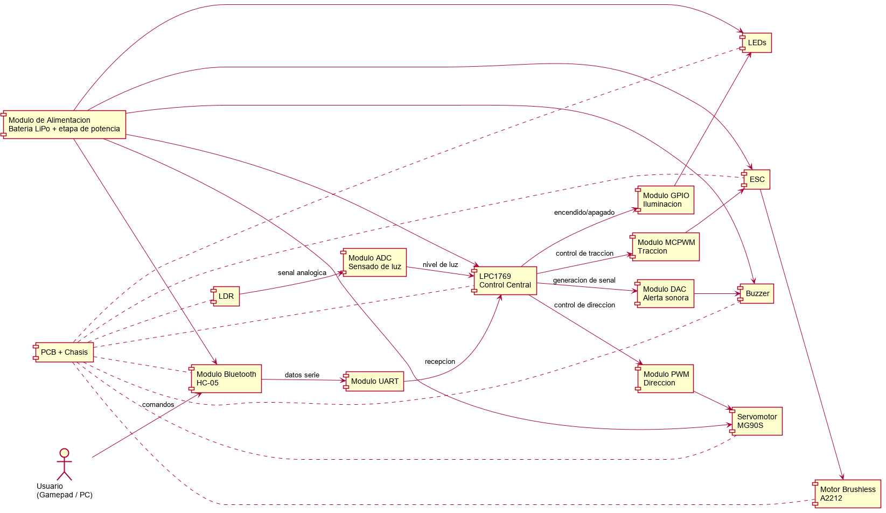
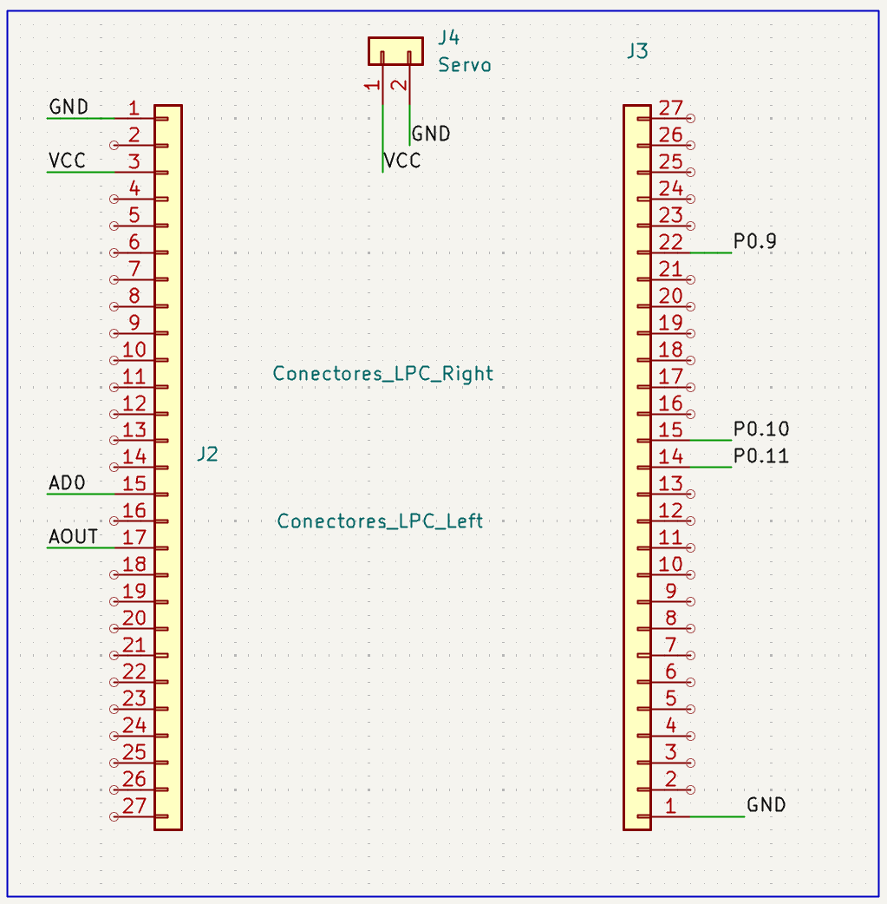
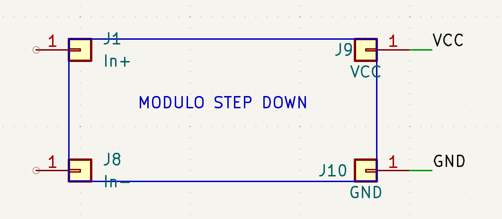
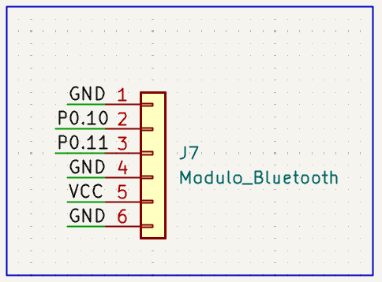
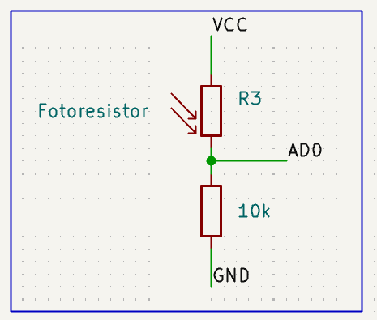
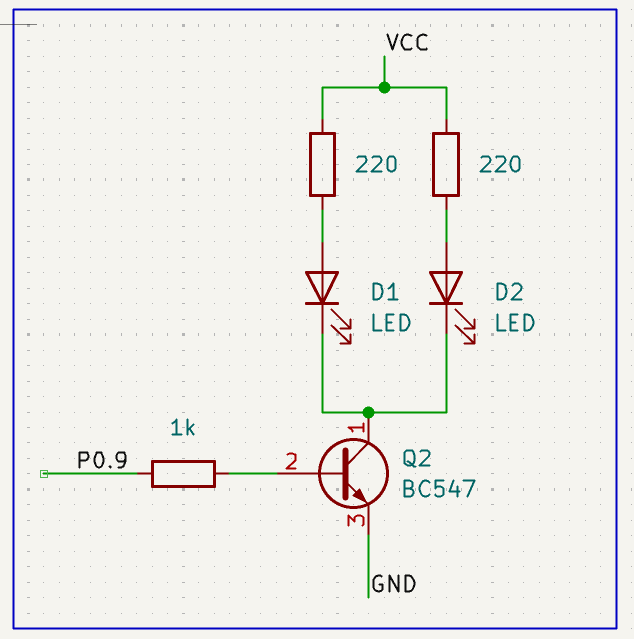
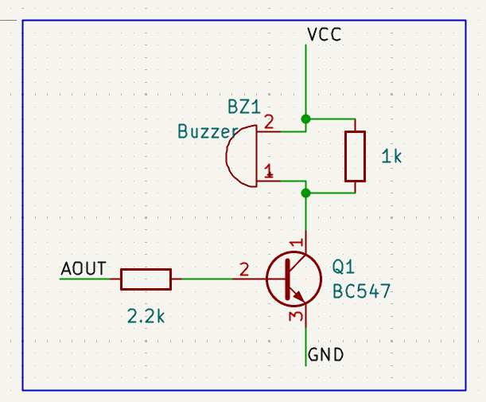
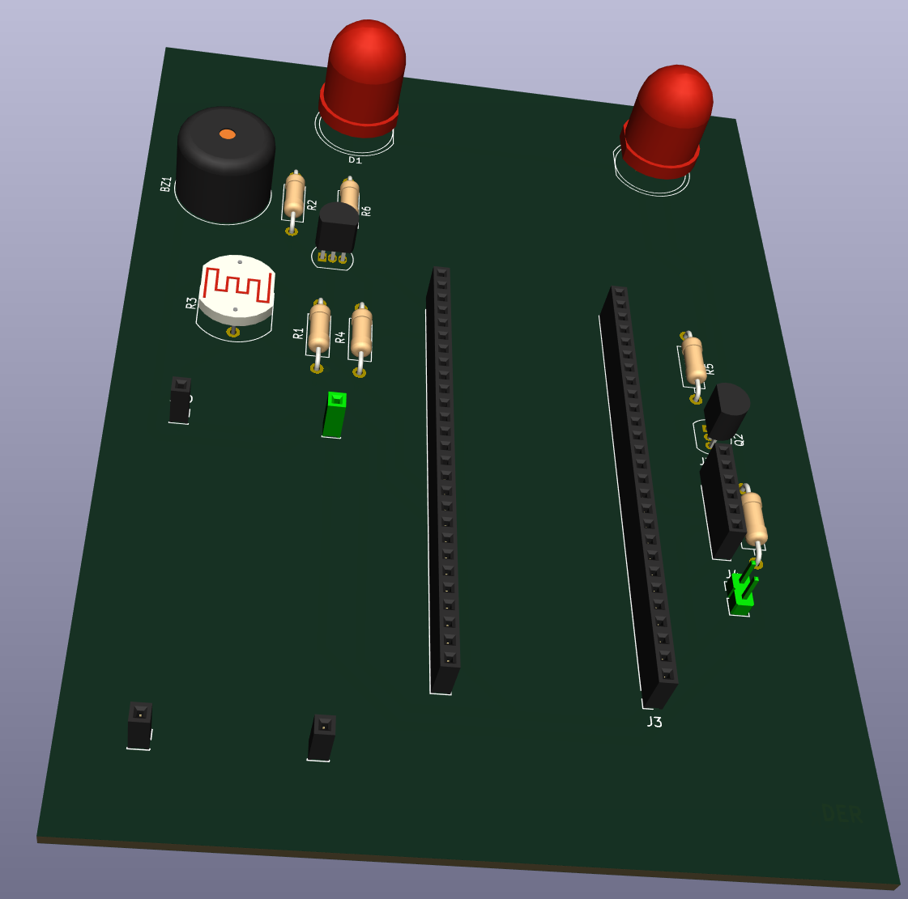
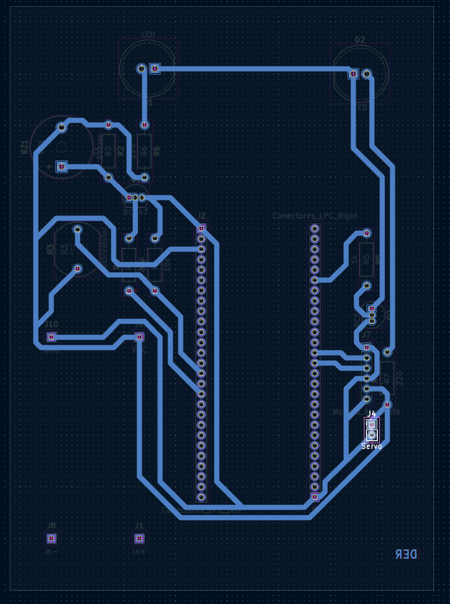

# Universidad Nacional de Córdoba
## Facultad de Ciencias Exactas, Físicas y Naturales
### Electrónica Digital 3

---

# Informe Final de Proyecto Final
**Título:** Diseño y Planificación de un Vehículo Terrestre Controlado Mediante Microcontrolador LPC1769

**Integrantes:**
- Juan Ignacio Pineda - DNI 45.591.343
- Juan Ignacio Cleri - DNI 46.452.662
- Aaron Alejandro Espinoza Sutta - DNI 96.009.173

---

## 1. Introducción y Justificación
El presente informe detalla el desarrollo de un vehículo a control remoto basado en el microcontrolador LPC1769 (arquitectura Cortex-M3). El proyecto se desarrolla utilizando el IDE **MCUXpresso** de NXP, aprovechando sus herramientas de depuración y gestión de proyectos para sistemas embebidos. El proyecto busca integrar conocimientos de sistemas embebidos, manejo de periféricos en tiempo real y protocolos de comunicación inalámbrica.
 El sistema propuesto combinará la potencia de un motor brushless para la tracción y la precisión de un servomotor para la dirección, todo coordinado mediante señales de control digital y sensado ambiental.

## 2. Objetivos del Proyecto
- Diseñar un sistema embebido robusto utilizando el microcontrolador LPC1769 como unidad de control central.
- Implementar el control de posición de un servomotor MG90S para el sistema de dirección mediante señales PWM.
- Gestionar la velocidad de un motor brushless A2212 mediante un controlador electrónico de velocidad (ESC) utilizando señales PWM.
- Integrar un sensor de luz (LDR) para permitir respuestas automáticas del vehículo ante variaciones de luminosidad.
- Establecer una comunicación inalámbrica vía Bluetooth (HC-05) para el mando remoto desde un Gamepad de PC.
- Configurar salidas digitales y PWM para sistemas de iluminación LED y una alerta sonora (bocina).
- **Desarrollo de Firmware:** Implementar o mejorar el driver del módulo **MCPWM** (Motor Control PWM) de la LPC1769, cumpliendo con la consigna de la cátedra de desarrollar/modificar un driver de periférico para optimizar el control de los actuadores.

## 3. Especificaciones de Hardware y Periféricos
Para cumplir con los objetivos, se planea la utilización de los siguientes módulos internos del LPC1769:

- **Comunicación Bluetooth (HC-05):** Se utilizará el módulo **UART** para la recepción de tramas de datos del mando remoto.
- **Control de Dirección (MG90S):** Se empleará el módulo **PWM** y **GPIO**, integrando un driver para motores DC que servirá como etapa de potencia para el servo.
- **Tracción (Motor Brushless A2212 1400KV):** Se utilizará el módulo **MCPWM**, aprovechando sus capacidades específicas para el control de motores y la generación de señales precisas para el ESC.
- **Sensor de Luz (LDR):** Se empleará el módulo **ADC** para la digitalización de la señal analógica lumínica.
- **Iluminación y Alerta:** Se utilizarán pines **GPIO** para los LEDs y el módulo **DAC** para el buzzer de 5V.
- **Alimentación:** El sistema será energizado mediante baterías de Polímero de Litio (LiPo) conectadas en serie (celdas de 3,7V), las cuales estarán ensambladas en un portapilas de alta corriente diseñado para soportar los requerimientos eléctricos del motor brushless.
- **Placa de Control:** El circuito electrónico será implementado en una **PCB de fabricación propia (casera)**, diseñada para integrar la LPC1769 con los drivers de potencia, sensores y módulos de comunicación en una plataforma compacta y robusta.

### 3.1. Diagrama general de componentes
El siguiente esquema resume la arquitectura funcional prevista para el sistema, mostrando la relación entre el usuario, la etapa de control basada en LPC1769 y los distintos actuadores, sensores y módulos auxiliares.

## 4. Metodología de Trabajo Propuesta
El desarrollo se llevó a cabo siguiendo estas etapas planificadas:

### 4.1. Construcción de la Estructura Mecánica y Electrónica
1. **Chasis:** Se utilizará el diseño de hardware abierto ["Chassis 1/10 Adaptable DKS Basic"](https://www.printables.com/model/447947-chassis-110-adaptable-dks-basic). Se imprimirán las piezas en 3D asegurando durabilidad mecánica.
2. **PCB:** Se diseñará y fabricará una placa de circuito impreso mediante métodos artesanales para centralizar las conexiones y minimizar el ruido eléctrico en las señales de control.

### 4.2. Implementación del Firmware
Se desarrollará el código en C/C++ utilizando el estándar **CMSIS** (Cortex Microcontroller Software Interface Standard). Para la gestión de los periféricos, se emplearán los drivers brindados por la cátedra, específicamente los disponibles en el repositorio:
[LPC17xx-CMSIS-Driver-Enhancement](https://github.com/David-A-T-M/LPC17xx-CMSIS-Driver-Enhancement.git).

El firmware se enfocará en:
1. Configuración de los relojes del sistema y asignación de funciones a los pines (Pin Connect Block).
2. Inicialización de los módulos UART, PWM y ADC con sus respectivos registros de control.
3. Desarrollo de una máquina de estados o lógica de control para procesar los comandos recibidos y actuar sobre los periféricos.

### 4.3. Integración y Pruebas
Se realizará el montaje electrónico sobre el chasis impreso, seguido de pruebas de banco para calibrar el rango de movimiento del servo y la curva de aceleración del motor brushless.

## 5. Resultados Esperados
Se espera obtener un prototipo funcional capaz de navegar en superficies planas, respondiendo con baja latencia a los comandos del usuario y activando sistemas automáticos (como luces o bocina) según el entorno.

## 6. Documentación de la Placa Electrónica (PCB)
El diseño de la PCB se centró en la creación de una plataforma centralizada para el LPC1769, garantizando la integridad de las señales y una distribución eficiente de la potencia para los actuadores.

### 6.1. Características del Diseño
- **Dimensiones:** 113mm x 83mm
- **Capas:** Placa de simple cara de fabricación artesanal.

### 6.2. Herramientas de Diseño
- **Software:** KiCad
- **Fabricación:** Método de transferencia de tóner.

### 6.3. Lista de Componentes
#### Electrónica de Control
- **Resistencias (THT):**
  - 220 $\Omega$ (x2)
  - 1k $\Omega$ (x2)
  - 10k $\Omega$ (x1)
  - 2,2k $\Omega$ (x1)
- **Semiconductores y Módulos:**
  - Transistor NPN BC547 (x2)
  - Diodo LED (x2)
  - Fotoresistor LDR (x1)
  - Módulo Bluetooth HC-05 (x1)
  - Módulo Regulador de voltaje Step Down (x1)
  - Buzzer Piezoeléctrico pasivo (x1)
- **Conectividad:**
  - Pines macho/hembra (x64)
  - Pines macho/macho (x2)

#### Actuadores y Alimentación
- **Motor:** Brushless A2212 1400KV.
- **Servo:** MG90S (Dirección).
- **Batería:** Pack 4S de Li-ion.

### 6.4. Esquema y Layout
El diseño electrónico se concibió de manera **modular**, permitiendo un desarrollo y testeo independiente de cada etapa (Alimentación, Bluetooth, Sensores, etc.). Es importante destacar que, aunque los esquemáticos se presenten por separado para mayor claridad, **todos los módulos están integrados en una única placa de cobre (PCB)**.

A continuación, se describen los módulos principales cuyos esquemáticos están documentados:
- **LPC:** Conexiones principales del microcontrolador LPC1769.
  
   
- **Alimentación:** Etapa de regulación y distribución de potencia.
 
  
   
- **Bluetooth:** Interfaz para el módulo HC-05.
 
  
   
- **Sensores y Actuadores:** Módulos para el Fotoresistor (LDR), LEDs de iluminación y el Buzzer.
 
  
   
   
  
   
   
  

### 6.5. Diseño de la PCB Final
Para la implementación física se optó por una placa de cobre de simple cara utilizando componentes de tecnología **THT** (*Through-Hole Technology* o tecnología de orificio pasante). En este tipo de componentes, los terminales atraviesan la placa a través de perforaciones y se sueldan en el lado opuesto.

**Estrategia de Diseño:**
- **Capa Superior (Top):** Ubicación de los cuerpos de los componentes.
- **Capa Inferior (Bottom):** Trazado de las pistas de cobre y puntos de soldadura.

Esta disposición permite que la soldadura sea accesible desde la parte inferior mientras los componentes quedan organizados en la parte superior. Una ventaja clave de este planteo en el software de diseño es que **no es necesario reflejar (espejar) el diagrama a la hora de imprimir** para el método de transferencia de tóner, simplificando el proceso de fabricación casera.

> **Nota sobre los LEDs:** El soldado de los diodos LED en la placa queda a disposición del desarrollador. Para un acabado más realista, se recomienda soldar cables a los pads de la PCB y montar los LEDs en la parte frontal del chasis del vehículo, simulando las ópticas delanteras.

 

**Descarga de Archivos de Diseño:**
Los archivos fuente de KiCad, incluyendo el esquemático completo y el diseño de la PCB, se encuentran disponibles en el siguiente archivo comprimido:
- [AutoRCPCB.zip](./docs/AutoRCPCB.zip) (Incluye proyecto KiCad, esquemáticos y archivos de fabricación).

## 7. Bibliografía
- NXP Semiconductors, "LPC176x/5x User manual (UM10360)".
- David-A-T-M, "LPC17xx-CMSIS-Driver-Enhancement", disponible en: https://github.com/David-A-T-M/LPC17xx-CMSIS-Driver-Enhancement.git
- "Chassis 1/10 Adaptable DKS Basic" project documentation, Printables.
- Bluetooth HC-05 Module Datasheet.
